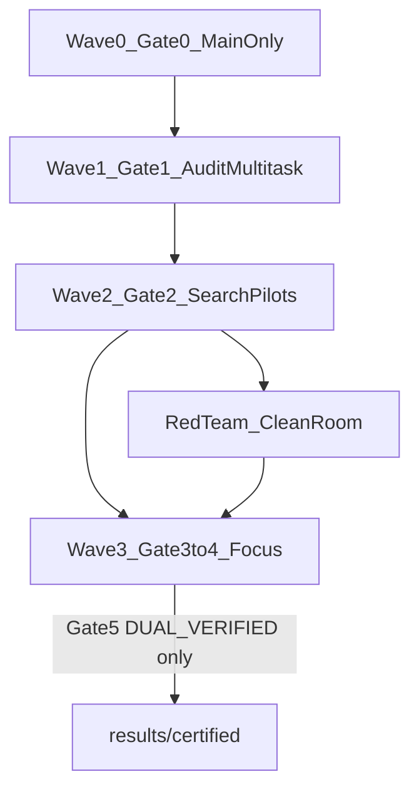

# Revised Plan: Conflict-Driven Escape from the 112/164 Basins

## 1. Executive summary

**Goal.** Find and independently dual-verify a legal construction with **|S| ≥ 165 on n=100** (primary) or **|S| ≥ 113 on n=64** (secondary).

**Why the old plan is insufficient.** Round-1 evidence shows the official baselines are deep local optima under **fail-closed, single-region** moves. Adding more single-box LNS iterations is unlikely to cross the barrier. The previous plan also: (a) prioritized generator search and soft SA with a weakly justified λ before measuring the **minimum Hamming distance** to any improving set; (b) treated asymmetric patches as optional; (c) proposed “blocked rows/columns” without a mathematical derivation; (d) understated that several Round-2 modules already exist on disk but **lack n=64/100 improvement logs**.

**Revised thesis.** Any +1 improvement from S₀ must remove at least r points and add r+1 others for some r ≥ 1. Prioritize **exact search in Hamming shells** whose variables are chosen from **blocker/conflict communities**, not hand-picked rings. Parallelize with **symmetry-core + asymmetric defect** (with Gate-1 per-axis-offset parity/orbit reachability audit: defects are **mandatory only** for axis types whose pure-orbit cardinality cannot reach 165/113; axis types with odd-sized fixed/special orbits must compare pure-orbit vs orbit-plus-defect) and **fixed-cardinality min-conflict** search. Use FunSearch-light only after verifiers, V(S), and search I/O are stable. **Execution waves are strict:** Gate 0 (Main only) → Gate 1 audit `/multitask` → Gate 2 search pilots `/multitask`; no breakthrough search before Gate 1 policy exists.

**Hard rule.** No claim of a new lower bound without: saved points, two independent verifiers PASS, hash + repro commands, Red Team clean-room check, and literature audit. Restricted-model UNSAT is **not** a global upper bound.

---

## 2. Repository fact-check table

| Claim | Status | Evidence in repo |
|---|---|---|
| Certified baseline n=64 size 112 | **Verified** | [`results/certified/n64_k112_baseline_official.json`](results/certified/n64_k112_baseline_official.json): `size=112`, `status=DUAL_VERIFIED`, `verifier_A_pass=true`, `verifier_B_pass=true`, `hash_sha256=47d42165…e9c292` |
| Certified baseline n=100 size 164 | **Verified** | [`results/certified/n100_k164_baseline_official.json`](results/certified/n100_k164_baseline_official.json): `size=164`, `DUAL_VERIFIED`, both verifiers true, `hash_sha256=8a84216d…bdc1` |
| Raw SOL_64 / SOL_100 | **Verified** | [`data/baselines/official_raw.py`](data/baselines/official_raw.py) |
| Verifier A (pivot uniqueness) | **Verified** | [`src/verification/oracle_verifier.py`](src/verification/oracle_verifier.py) |
| Verifier B (independent numpy sort path) | **Verified** | [`src/verification_independent/independent_verifier.py`](src/verification_independent/independent_verifier.py) |
| Certify / export path | **Verified** | [`src/verification/certify.py`](src/verification/certify.py), [`src/structures/candidate_io.py`](src/structures/candidate_io.py) |
| Incremental search state | **Verified** | [`src/search/incremental_state.py`](src/search/incremental_state.py) |
| n=100 exact LNS: 25153 iters, no improve | **Verified** | [`logs/lns_exact_n100_seed7.json`](logs/lns_exact_n100_seed7.json): `iterations=25153`, `improvements=[]`, `final_size=164` |
| n=64 exact LNS: 8613 iters, no improve | **Documented; log file missing** | Claimed in [`claim_registry.md`](claim_registry.md) Claim 4, [`STATUS.md`](STATUS.md), [`results/summaries/round1_summary.md`](results/summaries/round1_summary.md), [`FINAL_REPORT.md`](FINAL_REPORT.md). **No** `logs/lns_exact_n64_*.json` on disk → treat 8613 as **session-documented, artifact-incomplete**; Gate 0 may run a **new replay** (explicitly labeled as such; **not** a reconstruction of the original 8613-run artifact) |
| Combined “33766” exact repairs | **Derived from docs** | 8613+25153; only the 25153 half has a machine-readable log |
| Tabu no improve n=64/100 | **Verified** | [`logs/tabu_n64_seed3.json`](logs/tabu_n64_seed3.json) (4252 iters → 112); [`logs/tabu_n100_seed11.json`](logs/tabu_n100_seed11.json) (1810 → 164). Note: Round-1 summary also cites a 30s/401-iter tabu pilot; longer runs exist from a later session |
| Greedy LNS multiseed n=64 | **Verified** | [`logs/lns_greedy_n64_multiseed.json`](logs/lns_greedy_n64_multiseed.json): seeds 101–104 all size 112 |
| Center-probe MILP n=64 | **Verified** | [`logs/center_probe_n64.json`](logs/center_probe_n64.json): 8759 iters, best 112, `max_center_pts_in_any_repair=0` |
| H-001 central symmetry 100%/96.4% | **Verified as observation** | [`hypotheses.md`](hypotheses.md); recomputed in STATUS |
| Official notebook has **7** axis-offset types | **Verified** | Notebook `offsets = [(n-1,n-1),(n-2,n-2),(n,n),(n,n-1),(n-2,n-1),(n-1,n),(n-1,n-2)]` and `candidate_symmetry_types=[0..6]` in [`data/external/subsets_of_the_grid_with_no_isosceles_triangles.ipynb`](data/external/subsets_of_the_grid_with_no_isosceles_triangles.ipynb) |
| Paper believes 164 “still not optimal” | **External literature** | arXiv:2511.02864 §6.59 (cited in prior research; not re-fetched this revision) |
| Red Team Round 1 PASS | **Verified** | [`audits/red_team_round1.md`](audits/red_team_round1.md) |
| Soft-violation SA Strategy B (V(S) energy) | **Not implemented** | [`src/search/sa_exact_repair.py`](src/search/sa_exact_repair.py) exists but implements **SA over regional exact repairs with size decreases**, not soft illegal states |
| Multi-region exact LNS module | **Code exists; n=64/100 improvement runs 未核实** | [`src/search/lns_multiregion.py`](src/search/lns_multiregion.py); **no** matching improvement log under `logs/` |
| Symmetry-guided module | **Code exists; only central 180° pairs** | [`src/search/symmetry_guided.py`](src/search/symmetry_guided.py) — **not** the notebook’s 7 reflection-axis types; no success log for beating 112/164 |
| CP-SAT lazy encoding | **Code + small-n logs** | [`src/search/cpsat_lazy.py`](src/search/cpsat_lazy.py), [`logs/cpsat_small_n_sweep.json`](logs/cpsat_small_n_sweep.json) (exact C(4)=6, C(5)=7, C(6)=9 claimed); requires `.venv_solver` per module docstring |
| FunSearch-light | **Does not exist** | No evaluator/sandbox in repo |
| Blocker incidence graph / Hamming-shell solver | **Does not exist** | Proposed paths only |
| “Blocked rows/columns” as hard math constraint | **Not supported** | Old plan phrase; **removed**. Unused rows/cols in baselines are empirical occupancy stats (H-002 area), not legality constraints |

**Dual verification path (two independent logics).** Verifier A: per-pivot hash/set of squared distances. Verifier B: full distance matrix + per-row sort for adjacent duplicates, with Python re-confirm of witnesses. Both already marked PASS on certified baselines. Gate 0 will **re-run** both from disk JSON (not trust status fields alone).

---

## 3. Gaps in the previous plan

1. **No Phase-0 structural audit** before inventing neighborhoods (ring/frame/box chosen a priori).
2. **No Hamming-shell exact +1 search** — the most direct formulation of “beat 164 by one.”
3. **Soft energy λ≈2n** treated as primary without fixed-cardinality min-V alternative.
4. **Repair pool ⊆ S′ only** ⇒ can only delete points; cannot invent new legal points outside S′.
5. **Asymmetric defect treated as globally optional or globally mandatory** without a per-axis-offset parity/orbit reachability audit (targets 165/113 are odd, but some axis types may admit odd-sized fixed/special orbits).
6. **“Blocked rows/columns” SAT** unsupported by the problem definition.
7. **FunSearch too early** before conflict metrics and I/O contracts exist.
8. **Ignored existing Round-2 code** (`lns_multiregion`, `sa_exact_repair`, `symmetry_guided`, `cpsat_lazy`) and failed to distinguish “implemented” vs “shown to improve 112/164.”
9. **Missing n=64 exact-LNS log** treated as settled fact.

---

## 4. Revised scientific hypotheses

| ID | Hypothesis | Test |
|---|---|---|
| RH-1 | S₀ (164/112) is a deep basin for single-region exact repair | Already supported by Round-1 logs; do not re-spend primary budget on same route |
| RH-2 | Any +1 set lies at Hamming remove-radius r≥1 with add-radius r+1; small r may be reachable via blocker communities | Phase 1 shells r=1,2,3,… |
| RH-3 | Conflict coupling is non-local: distant points share pivots/distances; spatial boxes miss joint moves | Gate 1 community detection → Phase 4 |
| RH-4 | Near-optimal sets ≈ large reflection-symmetric core + few defects; for each of 7 axis-offsets, Gate 1 must decide whether pure-orbit cardinality can reach 165/113 — defects are mandatory only when cardinality-unreachable; otherwise compare pure-orbit vs orbit-plus-defect (legality still independent of parity) | Phase 2 + Gate 1 orbit audit |
| RH-5 | Soft landscapes should fix |S|=target and minimize V; λ-mixed objectives allow trivial size retreat | Phase 3 |
| RH-6 | Empty center may be necessary for near-optima **or** an artifact; decide via blocker stats + controlled center variables in shells, not folklore alone | Phase 0 + Phase 1 ablations |

**Conflict function (to verify in Gate 0 against oracle).** From Verifier A’s equivalence:

\[
V(S)=\sum_{b\in S}\sum_{d}\binom{m_{b,d}}{2},\quad
m_{b,d}=\#\{p\in S\setminus\{b\}: \|p-b\|_2^2=d\}.
\]

**Claim to prove/check in code:** \(V(S)=0 \iff S\) legal under the project definition. Gate 0 must fuzz-agree V with `is_legal_pivot_method` / independent verifier on random sets. If disagreement, **stop and fix definition before any search**.

---

## 5. Phase 0–5 (plan only; do not run this revision cycle)

### Phase 0 — Split into Gate 0 (Main) then Gate 1 (audit `/multitask`)

**Inputs.** Certified JSONs; `official_raw.py`; both verifiers; notebook offsets.

#### Gate 0 tasks (Main only — Wave 0; no formal breakthrough search)

1. Re-run `python -m src.verification.certify` on both candidates; re-run independent verifier CLI on disk files.
2. Diff legality definition text in A vs B vs paper/notebook; document coordinate convention `0_to_n_minus_1`.
3. Implement or verify automated tests that \(V(S)=0 \iff\) legal (fuzz vs both verifiers). If disagreement → **STOP**.
4. Check solver environment (incl. `.venv_solver` / ortools if used) and baseline I/O schema.
5. Optional: run a **new** short exact-LNS on n=64 and write e.g. `logs/lns_exact_n64_replay_seed1.json`, explicitly labeled as a **new replay**, **not** a reconstruction of the historical 8613-iteration artifact.

**Gate 0 acceptance.** Both baselines re-DUAL_VERIFIED; V↔legal tests PASS; env/I/O OK.
**Gate 0 stop.** Verifier inconsistency or V≢legal ⇒ halt; no Wave 1+.

#### Gate 1 tasks (Wave 1 — first `/multitask`; audit only, no 165/113 breakthrough search)

After Gate 0 passes:

- **Audit Agent A:** blockers, conflict incidence graph, insertion difficulty → `scratch/audit/agent_a/`.
- **Audit Agent B:** for each of 7 axis-offsets: orbit decomposition, fixed orbits, orbit sizes, cardinality/mod structure for targets 165/113 → `scratch/audit/agent_b/`.
- **Audit Agent C:** density, candidate-universe diagnostics, Hamming neighborhood / halo diagnostics → `scratch/audit/agent_c/`.
- **Main:** merge into unified `scratch/audit/phase0_neighborhood_policy.md` deciding Phase 1–4 universes.

**Also covered in Gate 1 (via the audit agents / Main merge):** community detection; ring/crowding/pressure stats; S₀ orbit completeness under each axis type + central 180° (H-001); empirical min escape-radius probes (diagnostic only); forbid hard-coding ring≤11/26 as sole universe unless audit supports it.

**Proposed outputs (do not exist yet).**

- `scratch/audit/phase0_baseline_reverify.json` (Gate 0)
- `scratch/audit/agent_a/blocker_stats_n100.json` / `_n64.json`
- `scratch/audit/agent_b/orbit_parity_reachability.json`
- `scratch/audit/agent_c/universe_halo_diagnostics.json`
- `scratch/audit/phase0_neighborhood_policy.md` (Main only)
- `logs/lns_exact_n64_replay_seed1.json` (optional Gate 0 new replay)

**Gate 1 acceptance.** Policy memo written; communities + per-axis orbit/parity table exist.
**Hard rule.** Until Gate 1 policy exists: **no** Search Agent A/B/C breakthrough pilots; **no** temporary community proxy.

### Phase 1 — Conflict-driven Hamming-shell exact search (**highest near-term priority**)

**Model.** Around baseline S₀ with |S₀|=k (164 or 112), seek S with |S|=k+1:

\[
|S_0\setminus S|=r,\qquad |S\setminus S_0|=r+1.
\]

**Solver choice.** Prefer **CP-SAT** ([`src/search/cpsat_lazy.py`](src/search/cpsat_lazy.py) already proves small-n exactness with lazy cuts) for feasibility at fixed cardinality / shell; use **MILP** ([`exact_repair_region`](src/search/lns_exact_repair.py)) when the free set is a small explicit candidate list and dense pairwise constraints are enumerable. SAT encodings are optional third backend if CP-SAT memory blows up. Reason: shell search is mostly **feasibility + conflict cuts**, where CP-SAT lazy separation matches existing project practice; full a-priori triple enumeration for n=100 is intractable.

**Universe restriction (soundness discipline).**

- **Primary universe U_r:** union of **Gate-1** blocker communities for the top-M “almost insertable” cells, plus an **adaptive halo** (graph distance ≤ h in the incidence graph, grown if pilots return trivial UNSAT too fast). Universes come only from `phase0_neighborhood_policy.md` after Gate 1.
- **Ablation universes:** frame-only; center-included; full grid (only for tiny r and tiny n pilots).
- Every UNSAT/OPT must be labeled: `scope = (n, r, U_id, halo, symmetry_mode, time_limit, seed)`.
- **Forbidden wording:** never promote restricted UNSAT to “C(100)≤164.”

**Joint non-adjacent regions.** Variables from multiple communities enter **one** model so coupled blockers can co-resolve.

**Destroy modes.** (i) symmetry-paired removes under central map or chosen axis-offset; (ii) deliberately asymmetric removes (especially useful when Gate-1 marks an axis type cardinality-unreachable for odd targets, and as a diversity ablation even when pure-orbit cardinality is reachable).

**Module ownership (Agent A).** Proposed exclusive paths: [`src/search/hamming_shell_conflict.py`](src/search/hamming_shell_conflict.py) (proposed); [`src/search/conflict_multiregion.py`](src/search/conflict_multiregion.py) (proposed, if not extending [`lns_multiregion.py`](src/search/lns_multiregion.py) under Main-approved ownership transfer); matching exclusive tests under `tests/` owned by Agent A.

**Schedule (planned defaults; tune after pilots).**

| r | n=100 wall / seeds | Upgrade rule |
|---|---|---|
| 1 | 30–120 min × ≥8 seeds | If all scoped UNSAT or timeout with 0 feas → r=2 |
| 2 | 2–8 h × ≥8 seeds | Same |
| 3+ | day-scale if RH-2 still open and communities suggest larger hitting sets | Cap r_max from Phase-0 hitting-set lower bounds |

**Artifacts (proposed).**

- `scratch/agent_a/hamming/r{r}_n{n}_seed{s}.json` — model hash, U, status, incumbent points if any
- `scratch/agent_a/hamming/manifest.jsonl`

**Independent verify.** Any feasible S with |S|≥k+1 → write candidate via `candidate_io` → Main only runs `certify.py`.

### Phase 2 — Symmetry core + asymmetric defect (orbit search)

**Verified prior.** Notebook defines **exactly 7** offset pairs (see fact-check). Existing [`symmetry_guided.py`](src/search/symmetry_guided.py) only does central 180° — **insufficient**; new work must cover notebook types **or** explicitly justify a subset after Gate-1 orbit scores.

**Parity / orbit reachability (Gate 1 → Phase 2; conditional, not a blanket theorem).**
Because targets 165/113 are odd, Gate 1 **must** audit each of the seven axis-offsets separately:

1. Enumerate orbits that actually land inside the grid;
2. Tabulate orbit sizes;
3. Identify fixed orbits and boundary/special orbits;
4. Decide whether 165/113 is **cardinality-reachable** under pure-orbit combinations for that axis type;
5. Classify outcomes: `cardinality_unreachable` | `cardinality_reachable_but_legality_open` | `restricted_model_timeout` | `feasible_pure_orbit_candidate`;
6. Mark defects as **mathematically mandatory only** when that axis type is `cardinality_unreachable`. For axis types that remain cardinality-reachable via odd-sized fixed/special orbits, **compare** pure-orbit vs orbit-plus-defect. Cardinality reachability never implies legality.

**Model comparison.**

| Model | Scale | Risk | Info value | Stop |
|---|---|---|---|---|
| 2a Full-symmetric orbit-MILP/CP-SAT | Small (#generators) | May be cardinality-unreachable on some axis types (per Gate 1) | Scoped max size / UNSAT **within** that symmetry | Per-axis OPT or scoped UNSAT/timeout recorded |
| 2b Fix near-symmetric core; search 1–8 defect points | Medium | Core choice bias | Primary when Gate 1 marks defects mandatory; always a diversity route | No improve after budget / cores exhausted |
| 2c Partial orbit breaking (some generators unpaired) | Larger | Combinatorial blowup | Bridges 2a–2b | Pilot shows no diversity vs 2b |
| 2d Lazy conflict separation | Variable | Cut loops | Scalable exactness | Same as CP-SAT lazy discipline |

Must encode: intra-orbit illegal triples; pairwise orbit–orbit conflicts; triple orbit interactions (lazy); orbit vs fixed complement; orbit size 1/2/4 and any Gate-1 special sizes; fixed points.

**Module ownership (Agent B).** Exclusive proposed path: [`src/search/orbit_defect_search.py`](src/search/orbit_defect_search.py); exclusive tests; outputs under `scratch/agent_b/` (search) and Gate-1 orbit tables under `scratch/audit/agent_b/`.

### Phase 3 — Fixed-cardinality minimum-conflict soft search

**Primary objective.** Fix |S|=165 (n=100) or 113 (n=64); minimize V(S) defined above. Record min V, conflict multiset structure, time-to-best — not only final legal size.

**Moves.** 1-for-1, 2-for-2, ejection chains, large swaps, parallel tempering / reheating. **Do not** use E=−|S|+λV as the sole objective (λ under-justified; encourages shrinking).

**Exact repair pool (must be able to grow beyond parent).** Candidates ⊆ S′ ∪ Halo(blocker communities from Gate 1) ∪ recently deleted ∪ top “almost-legal” cells from Gate 1. Repair solves max legal subset **or** feasibility at size target inside that pool — never S′-only deletion repair as the only operator.

**Reuse note.** [`sa_exact_repair.py`](src/search/sa_exact_repair.py) is a different algorithm (size-SA on exact regions). Keep it as a **secondary** fail-closed escape; it does **not** replace Phase 3.

**Module ownership (Agent C).** Exclusive proposed path: [`src/search/fixed_cardinality_minconflict.py`](src/search/fixed_cardinality_minconflict.py); exclusive tests; outputs under `scratch/agent_c/`.

### Phase 4 — Conflict-driven multi-region exact repair

Transform spatial multi-region ([`lns_multiregion.py`](src/search/lns_multiregion.py) exists but **unproven on 164/112**) into conflict-driven joint repair (Agent A owns new module or Main-approved transfer of the existing file):

- Destroy sets = Gate-1 communities (possibly spatially distant);
- Compare pure boxes vs conflict communities vs hybrid;
- Dynamic |variables| from pilot solve times (not fixed 40–80 dogma);
- Diversity: no-goods, elite archive, solution pool to avoid re-entering identical 164/112 basin;
- Pilots decide whether to grow spatial radius, conflict closure, or Hamming r.

**Stop.** If after Gate-2 pilots multi-region never reduces V at fixed 165 and never finds +1 in shells overlapping its neighborhoods, demote vs Phase 1/3.

### Phase 5 — FunSearch-light (conditional late)

**Enter only if** Gate 0–2 pass and Phases 1–3 expose a stable `search(n,seed,budget)->(points,meta)` API + fast V evaluator.

**Requirements.** Sandbox (timeout, memory, no filesystem writes outside scratch); ban mutating verifiers/baselines; train vs holdout seeds; fitness = legal size **and** min V@165/113, time-to-best, multi-seed stability, illegal-output rate, structural diversity; daily eval uses independent verifier; dual certify only for promotion; stop if no fitness gain over elite heuristics for a pre-set wall (e.g. 7 days) or overfitting to one seed/verifier.

**Proposed paths.** `scratch/funsearch/` (proposed); not present now.

---

## 6. Route priority and rationale

| Priority | Route | Why |
|---|---|---|
| P0 | Gate 0 + Gate 1 audit | Neighborhoods and orbit/parity facts must precede search |
| P1 | Phase 1 Hamming-shell | Directly encodes +1; uses blocker structure; exact scoped answers |
| P1 (parallel) | Phase 2 orbit+defect | Matches AlphaEvolve inductive bias; Gate-1 parity audit decides when defects are mandatory vs comparative |
| P1 (parallel) | Phase 3 fixed-card min-V | Soft escape with measurable progress short of legality |
| P2 | Phase 4 conflict multi-region | Extends existing code; needs Gate-1 communities |
| P3 conditional | Phase 5 FunSearch-light | Historically powerful; high overhead; after infra |

---

## 7. Mathematical modeling and verification requirements

- **Legality:** per-pivot squared-distance uniqueness (A/B docs). Degenerate midpoints included.
- **V(S):** as above; Gate 0 equivalence tests mandatory.
- **Certificates:** only `certify.py` promotion to `results/certified/`.
- **Solver claims:** always scoped; HiGHS/CP-SAT timeout ⇒ feasible incumbent only, not OPT.
- **Integer distances only;** no floats in legality.
- **Schema for search outputs (unified):**

```json
{
  "schema": "grid_no_isosceles.search_result.v1",
  "n": 100,
  "target_size": 165,
  "method": "...",
  "seed": 0,
  "git_commit": "...",
  "scope": {"r": 2, "universe_id": "...", "halo": 1},
  "solver_status": "OPTIMAL|FEASIBLE|INFEASIBLE|TIMEOUT",
  "points": [[x,y],...],
  "size": 0,
  "V": 0,
  "parent_hash": "8a84216d...",
  "points_hash": null,
  "verify": {"A": null, "B": null}
}
```

---

## 8. Future `/multitask` role split (do not launch this cycle)

Strict waves (no search before Gate 1 policy):



| Wave | Who | Allowed work | Forbidden |
|---|---|---|---|
| Wave 0 | Main only | Gate 0 reverify, V↔legal, env/I/O, optional **new** n=64 LNS replay (labeled) | Any formal +1 / 165 search; Audit or Search agents |
| Wave 1 | First `/multitask`: Audit A/B/C + Main merge | Structure audit only; Main writes `phase0_neighborhood_policy.md` | Breakthrough search; temporary community proxies |
| Wave 2 | Second `/multitask`: Search A/B/C; Red Team spot-checks | Gate 2 pilots using Gate-1 universes | Starting pilots before Main marks Gate 1 passed |
| Wave 3 | Main + focused Search agents | Gate 3 rank by min V, shell progress, diversity, time-to-best, scoped solver status, any legal +1; Gate 4 compute on top 1–2 routes | Spreading equal budget across flat routes |

**Role duties.**

- **Main:** sole Gate passer; sole promoter to `results/candidates/` / `results/certified/` (certified only after Gate 5); owns shared schema/manifests; applies shared-file patches from scratch proposals.
- **Audit Agent A / Search Agent A:** Gate 1 blockers; then Phase 1 + Phase 4 search. Owns listed A modules (Section 9).
- **Audit Agent B / Search Agent B:** Gate 1 orbit/parity; then Phase 2. Owns B modules.
- **Audit Agent C / Search Agent C:** Gate 1 density/universe/halo; then Phase 3. Owns C modules.
- **Red Team:** from Wave 2 onward as capacity allows; never trusts search caches; does not share implementation with searchers; audits V, scope labels, candidates, solver claims; writes only `audits/**` + Red Team scratch.

**Isolation.** Pass points, hashes, params, seeds, solver status, verify reports — not prose claims alone. No simultaneous edits to the same file.

---

## 9. File write boundaries and artifact schema (exclusive ownership)

| Role | May write (exclusive) | Must not write |
|---|---|---|
| **Search/Audit Agent A** | `src/search/hamming_shell_conflict.py` (proposed); `src/search/conflict_multiregion.py` (proposed) **or** Main-approved sole ownership of extending `lns_multiregion.py`; matching exclusive tests; `scratch/agent_a/**`; Gate-1 `scratch/audit/agent_a/**` | Baselines; verifier A/B; Agent B/C modules; `results/certified/**`; shared schema unless Main pre-approves a patch proposal |
| **Search/Audit Agent B** | `src/search/orbit_defect_search.py` (proposed); exclusive tests; `scratch/agent_b/**`; `scratch/audit/agent_b/**` | Other agents’ modules; verifiers; baselines; certified |
| **Search/Audit Agent C** | `src/search/fixed_cardinality_minconflict.py` (proposed); exclusive tests; `scratch/agent_c/**`; `scratch/audit/agent_c/**` | Other agents’ modules; verifiers; baselines; certified |
| **Main** | Review/merge; unified schema & manifests; `results/candidates/` after dual verify of a handoff; `results/certified/` **only after Gate 5**; apply shared-file patches; Gate 0 artifacts under `scratch/audit/` root / `logs/` replays | Editing Agent A/B/C exclusive modules without ownership transfer; promoting without dual verify |
| **Red Team** | `audits/**`; independent adversarial tests; Red Team scratch | Searcher code to “make tests pass”; formal verifiers; baselines; direct candidate promotion |

**Shared files.** Search agents may only put patch proposals in their own scratch; Main applies after review; never two agents edit the same shared file concurrently.

**Each source file has exactly one owner.** Existing Round-2 modules remain untouched by Search agents unless Main explicitly transfers ownership for a named file.

---

## 10. Stage gates, budgets, stop conditions

| Gate | Input | Tasks | Output | Pass criteria | Fail / stop |
|---|---|---|---|---|---|
| G0 (Wave 0, Main) | Certified baselines | Reverify; legality/coords; V↔legal tests; solver/I/O; optional **new** n=64 LNS replay (labeled) | `scratch/audit/phase0_baseline_reverify.json`; optional `logs/lns_exact_n64_replay_*.json` | Dual PASS; V tests PASS | Verifier/V mismatch → STOP; **no** formal search |
| G1 (Wave 1, audit `/multitask`) | G0 | Audit A/B/C structure only; Main policy memo | `scratch/audit/agent_{a,b,c}/**`; `phase0_neighborhood_policy.md` | Communities + per-axis orbit/parity table + policy exist | Incomplete audit → **no** Wave 2 search |
| G2 (Wave 2, search `/multitask`) | G1 passed by Main | Pilots: A Hamming r=1 + multi-region; B orbit/core/defect; C fixed-165 min-V; Red Team spot-checks | Pilot reports under `scratch/agent_{a,b,c}/` | Each search route ≥1 completed pilot with scoped status | Infra crash → fix before G3 |
| G3 (Wave 3) | G2 | Compare min V, shell progress, diversity, time-to-best, scoped solver status, any legal +1 | Route ranking | Pick top 1–2 routes | All flat → expand halo/r or revisit RH |
| G4 | G3 | Majority CPU on winners | Long-run logs | Checkpoints every N minutes | No +1 and no V progress for budget → informative failure |
| G5 | Any candidate ≥165/113 | Clean-room dual verify + Red Team | Certified JSON (Main only) | Both verifiers PASS | Fail verify → reject |
| G6 | G5 pass | Literature / priority audit | `record_registry` update | No known identical prior (scoped) | Known prior → downgrade claim |

**Checkpoints / resume.** Every run writes atomic JSON + `git rev-parse HEAD` + seed + scope; resume from last checkpoint; never silently continue with dirty trees without recording commit.

**Illustrative budgets (not “infinite search”).** G0–G1: hours; G2: hours; G4 primary: days–weeks on n=100; n=64 secondary after n=100 methods stabilize or in parallel if cores allow.

---

## 11. Risk register

| Risk | Mitigation |
|---|---|
| Restricted UNSAT misread as global UB | Scoped labels; claim_registry forbidden wording |
| Verifier bug shared across A/B | Red Team adversarial suite; third path optional |
| Soft search collapses to smaller legal sets | Fixed cardinality |
| Repair-only-deletes | Mandatory external halo pool |
| Odd targets vs symmetry models | Gate-1 per-axis parity/orbit reachability; defects mandatory only if cardinality-unreachable; else compare pure-orbit vs defect |
| Basin revisits | No-goods + elite diversity |
| FunSearch overfit / unsafe code | Sandbox; holdout seeds; late start |
| Missing n=64 LNS artifact | Optional Gate 0 **new replay** (labeled; not fake reconstruction of 8613) |
| Existing Round-2 modules untested at scale | G2 must include them as baselines, not assume success |
| OR-Tools only in `.venv_solver` | Document interpreter path; CI note |

---

## 12. Evidence grades

**True success (new lower bound).** size≥165/113; points saved; A and B PASS; hash+repro; literature audit; Red Team no critical flaw.

**Informative success.** Lower V at |S|=165; scoped Hamming-shell UNSAT/OPT; symmetry-model max size; measured min escape radius; better searcher than Round-1 LNS without +1.

**Failure report contents.** Models/radii tried; regions never searched; OPT vs timeout vs incumbent; best V and structure; which routes still worth compute; explicit “scoped only” negatives.

---

## 13. Recommended execution order (after human approval)

1. **Wave 0 / Gate 0 (Main only):** dual reverify; V↔legal; env/I/O; optional labeled n=64 LNS new replay. **No** formal breakthrough search.
2. **Wave 1 / Gate 1 (first `/multitask`):** Audit Agents A/B/C in parallel (structure only); Main merges `phase0_neighborhood_policy.md`. **No** Search pilots; **no** temporary proxies.
3. **Wave 2 / Gate 2 (second `/multitask`):** only after Main marks Gate 1 passed — Search A/B/C pilots; Red Team independent spot-checks of V, scopes, candidates, solver claims.
4. **Wave 3 / Gates 3–4:** Main ranks by min V, shell progress, diversity, time-to-best, scoped solver status, any legal +1; focus compute on top 1–2 routes.
5. Gates 5–6 only if a candidate ≥165/113 appears.
6. Phase 5 only if still short of targets and soft metrics plateau with clear heuristic gaps.

---

## 14. `/multitask` waves after approval (describe only — do not start)

### Wave 0 — Gate 0 (Main; not a search `/multitask`)

1. Dual-verify 164/112 from disk; check legality text and `0_to_n_minus_1`.
2. V(S) ↔ legality equivalence tests; STOP on failure.
3. Solver env + I/O sanity.
4. Optional **new** n=64 exact-LNS replay → `logs/lns_exact_n64_replay_*.json` with explicit `replay_not_original_8613: true`.

### Wave 1 — Gate 1 (first `/multitask`; audit only)

1. **Audit Agent A:** blockers / incidence graph / insertion difficulty → `scratch/audit/agent_a/`.
2. **Audit Agent B:** seven axis-offset orbit sizes, fixed/special orbits, 165/113 cardinality reachability → `scratch/audit/agent_b/`.
3. **Audit Agent C:** density, candidate universes, Hamming/halo diagnostics → `scratch/audit/agent_c/`.
4. **Main:** write `scratch/audit/phase0_neighborhood_policy.md`. Until this exists, Wave 2 is forbidden.

### Wave 2 — Gate 2 (second `/multitask`; formal pilots)

1. **Search Agent A:** Hamming-shell r=1 (+ multi-region pilot) using **only** Gate-1 policy universes; implement/own `hamming_shell_conflict.py` / conflict multi-region module; write `scratch/agent_a/`.
2. **Search Agent B:** orbit/core/defect pilot per Gate-1 parity table; own `orbit_defect_search.py`; write `scratch/agent_b/`.
3. **Search Agent C:** fixed \|S\|=165 min-V pilot + halo repair; own `fixed_cardinality_minconflict.py`; write `scratch/agent_c/`.
4. **Red Team:** independent spot-check of V implementation, scope strings, any candidate points, and solver-status claims (no shared searcher logic).

### Wave 3 — Gates 3–4

Main compares the three routes on min V, shell progress, diversity, time-to-best, scoped solver status, and whether any legal +1 appeared; then concentrates budget on the best 1–2 routes.

---

## Appendix — Why search stalled at 164/112 (evidence-based)

Fail-closed single-region exact repair explored tens of thousands of **conditionally optimal** local refills with the complement frozen ([`logs/lns_exact_n100_seed7.json`](logs/lns_exact_n100_seed7.json); n=64 figure documented but log missing). Tabu, greedy LNS, and center-probe likewise never increased size. That pattern is consistent with needing **multi-locus / soft / representational** escape — which this revision prioritizes — not more of Route C alone.
